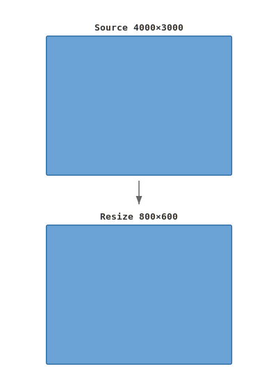
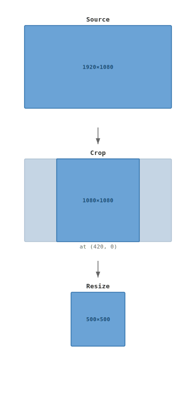
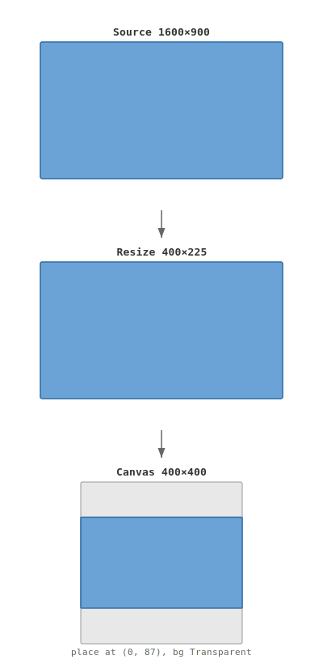
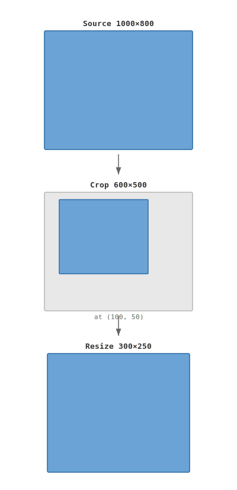
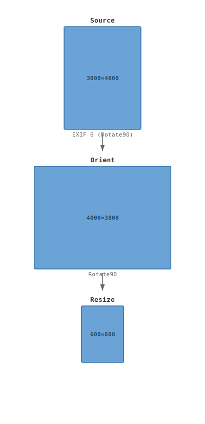
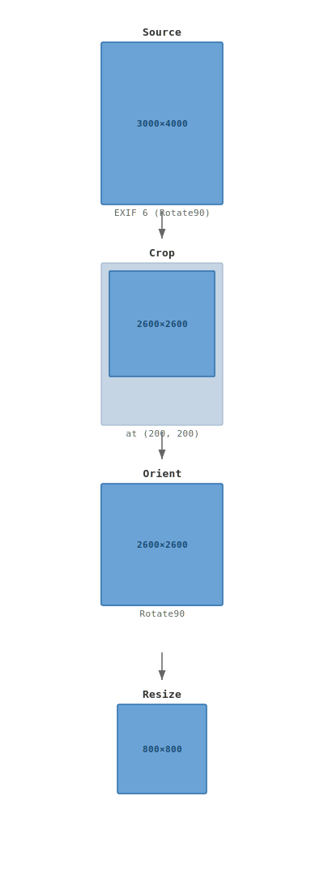
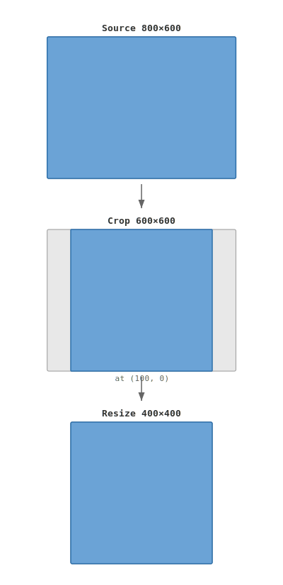

# Layout Pipeline Examples

Visual walkthroughs of common layout operations. Each diagram shows the
pipeline steps computed by `Pipeline::plan()` and `IdealLayout::finalize()`.

Blue = image content. Grey = unused/padding area. Dashed = edge-replicated extension.

---

## Fit (downscale to target)

The most common operation. Scales the image to fit within the target
dimensions, preserving aspect ratio.

```rust
Pipeline::new(4000, 3000).fit(800, 600)
```



---

## FitCrop (fill target, crop overflow)

Scales to fill the target, then center-crops the excess. No padding,
no letterboxing.

```rust
Pipeline::new(1920, 1080).fit_crop(500, 500)
```



---

## FitPad (fit within target, pad remainder)

Scales to fit, then pads with the canvas color to reach the exact
target size. Useful for fixed-size slots (thumbnails, social cards).

```rust
Pipeline::new(1600, 900).fit_pad(400, 400)
```



---

## Crop + Fit

Explicit source crop followed by a resize. The crop selects a
sub-region before any scaling.

```rust
Pipeline::new(1000, 800)
    .crop_pixels(100, 50, 600, 500)
    .fit(300, 250)
```



---

## Orientation + Resize

EXIF orientation is applied before computing the resize. The source
panel shows the raw (pre-rotation) dimensions; the Orient step shows
the logical dimensions after rotation.

```rust
Pipeline::new(4000, 3000)     // raw EXIF: landscape
    .auto_orient(6)            // Rotate90 -> portrait
    .fit(600, 800)
```



---

## Full Pipeline (orient + crop + pad)

Combining orientation, cropping, and padding. The pipeline applies
each transformation in sequence: orient the logical view, crop a
region, resize, then place on a padded canvas.

```rust
Pipeline::new(4000, 3000)
    .auto_orient(6)
    .crop_pixels(200, 200, 2600, 2600)
    .fit_pad(800, 800)
```



---

## WithinCrop (downscale only, crop to target ratio)

Like FitCrop but never upscales. If the source is already smaller than
the target, crops to the target aspect ratio without scaling.

```rust
Pipeline::new(800, 600).within_crop(400, 400)
```



---

## MCU Edge Extension

For JPEG and other block-based codecs, dimensions must be multiples of
the MCU size (typically 8 or 16). `Align::Extend` rounds up and
replicates edge pixels into the extension area. The codec encodes the
extended image; the decoder can crop back to `content_size`.

```rust
Pipeline::new(801, 601)
    .output_limits(OutputLimits {
        max: None,
        min: None,
        align: Some(Align::uniform_extend(16)),
    })
```


---

## Generating these diagrams

```rust
use zenlayout::{Pipeline, DecoderOffer, svg::render_layout_svg};

let (ideal, req) = Pipeline::new(4000, 3000)
    .fit(800, 600)
    .plan()
    .unwrap();

let offer = DecoderOffer::full_decode(4000, 3000);
let plan = ideal.finalize(&req, &offer);

let svg = render_layout_svg(&ideal, &plan);
std::fs::write("layout.svg", &svg).unwrap();
```

The SVGs adapt to light and dark mode via `prefers-color-scheme`.
